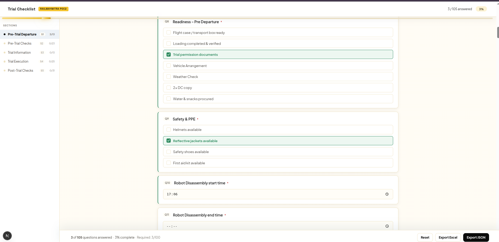
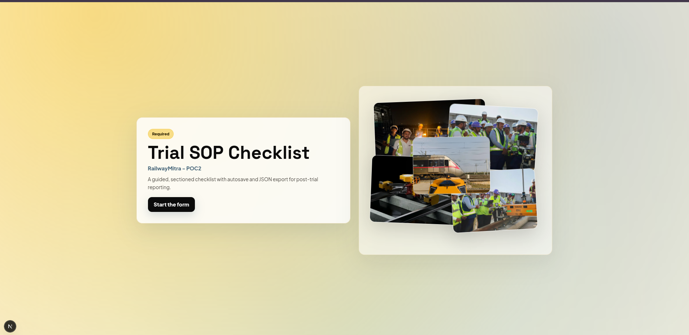

# Trial SOP Checklist (RailwayMitra - POC2)

Sectioned trial SOP checklist web app with **local-first autosave**, **multi-trial resume**, and **exports (JSON + CSV)**.

## Demo

<p align="center">
  
</p>
<p align="center">
  
</p>

## Why This App

Trial data entry is often **irregular**:
- Section 1 can be filled in the office.
- Later sections are filled on track at different time intervals.
- Connectivity can be weak or intermittent.

This app is built to **retain trial state safely** so the operator can continue later without losing progress.

## Key Features

- **Checklist flow** split into sections with progress and required indicators
- **Autosave** (local-first) so work is not lost if the tab is closed or network drops
- **Multiple trials** per device/browser (each trial has its own `trialId`)
- **Resume link** support via `/form?trialId=...`
- **Exports**
  - `JSON` (structured payload)
  - `CSV` (Excel-friendly)
- **Mobile-first UX**
  - Responsive layout
  - Phone-only collapsible actions so the form is not covered

## Tech Stack

- Next.js (App Router)
- React

## Getting Started

### Prerequisites

- Node.js 18+ (recommended)

### Install

```bash
npm ci
```

### Run (dev)

```bash
npm run dev
```

Open `http://localhost:3000`.

## Usage

### Start / Resume a Trial

Open the form at `/form`.

- Click **Trials** to:
  - create a **New trial**
  - open a previously saved trial on this device
  - copy a **resume link** (`/form?trialId=...`)
  - delete a trial (device-local)

### Reset / Export

- **Reset** clears the current trial’s answers (keeps the same `trialId`).
- **Export Excel** downloads a `CSV`.
- **Export JSON** downloads a `JSON` snapshot.

## Data Persistence Model

- Data is stored locally in the browser (LocalStorage).
- Each trial is saved separately using its own `trialId`.
- An index of recent trials is maintained to support switching/resume.

### Limitations

- LocalStorage is **per device + per browser profile**.
- Clearing site data will remove saved trials.

If you need cross-device resume (phone ↔ laptop), add backend sync (see “Roadmap”).

## Scripts

- `npm run dev` — start dev server
- `npm run build` — production build
- `npm start` — run production server
- `npm run lint` — run ESLint

## Project Structure

- `app/page.js` — landing page
- `app/form/page.js` — form route
- `app/components/ChecklistApp.jsx` — checklist UI, scrollspy, autosave, trial switcher, exports
- `lib/checklistData.js` — checklist schema
- `lib/checklistStorage.js` — trial persistence helpers
- `public/demo1.png`, `public/demo2.png` — README screenshots

## Deployment

### Vercel

```bash
npm ci
npm run build
```

### Node Server

```bash
npm ci
npm run build
npm start
```

## Roadmap (Optional)

- Backend sync keyed by `trialId` for cross-device resume
- Field-level conflict handling for multi-device edits
- IndexedDB storage (better for large payloads / attachments)

## License

Private / internal project (update if you intend to open source).

